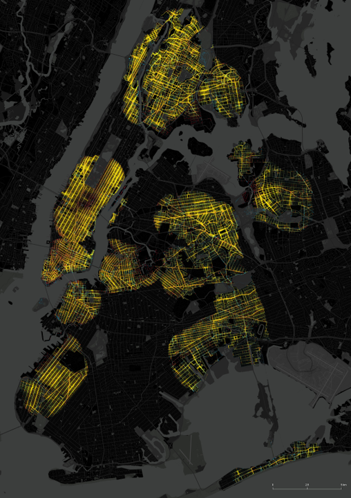

.. madina documentation master file, created by
   sphinx-quickstart on Mon Oct 23 15:39:25 2023.
   You can adapt this file completely to your liking, but it should at least
   contain the root `toctree` directive.

Madina
============
Madina **(Arabic for the word 'city')** is a python package of classes and functions to streamline the representation and analysis of urban data. The package enables layer management (Similar to layers in CAD/GIS), spatial network representation, and spatial visualizations. The package also includes a Python implemetation of the **Urban Network Analysis Toolbox** (`Homepage <https://unatoolbox.notion.site/>`_). The source code for Madina is available `on github <https://github.com/City-Form-Lab/madina>`_.

.. toctree::
   :maxdepth: 2
   :caption: Installation Guides:

   installation_guide
   notebooks/quickstart

UNA Pedestrain Flow Simulation
====================================
The package enables modelling pedestrian accessibility and movement in urban areas between pairs of pre-specified origins and destinations. This can be done by following these steps:
* Prepare input data files for the network, and each origin and destination. Place all data in a folder called ``Cities/city_name/Data``

* Fill in the pairing table to specify origin-destination pairs, and specify specific parameters for each pair. Save the filled pairing table in the same ``Cities/city_name/Data`` folder

* run the simulation::

   from madina.una.betweenness import betweenness_flow_simulation

   betweenness_flow_simulation(
      city_name="new_york"
   )

* Output would be saved in ``Cities/city_name/Simulations``.
* More instructions on running a pedestrain flow simulation, preparing data and creating the pairing table are found in the documentation here

.. toctree::
   :maxdepth: 2
   :caption: Instructions for Preparing and Running a Simulation:

   ped_flow

Package reference
==================
* :doc:`reference`
