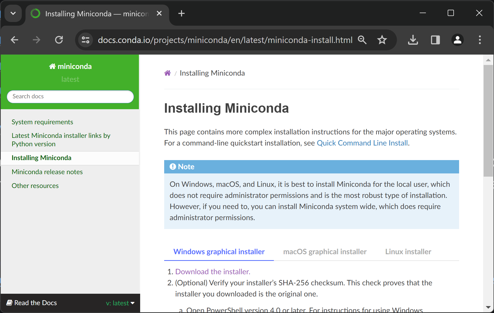
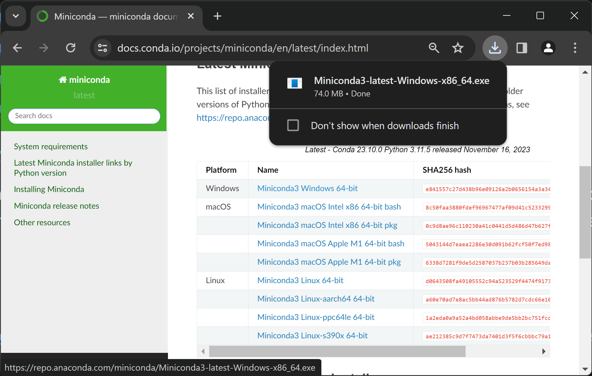
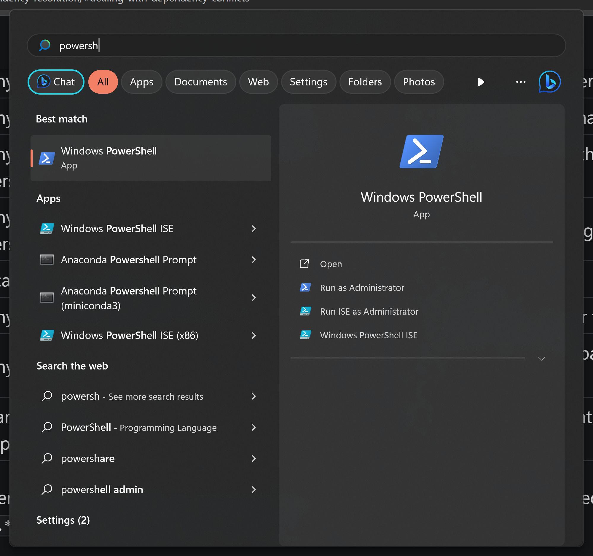
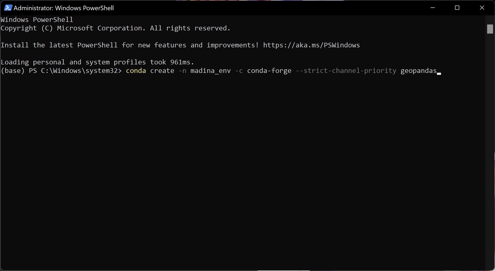
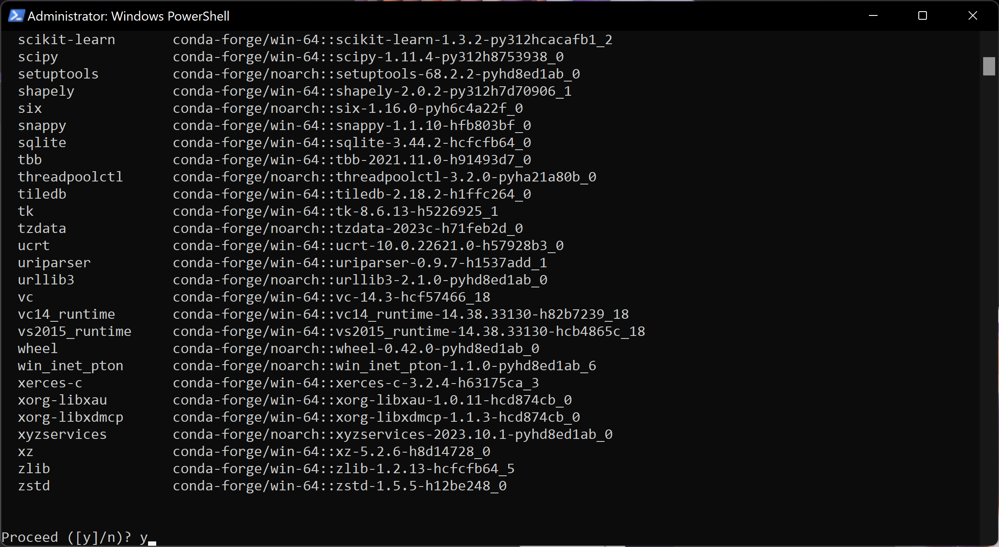
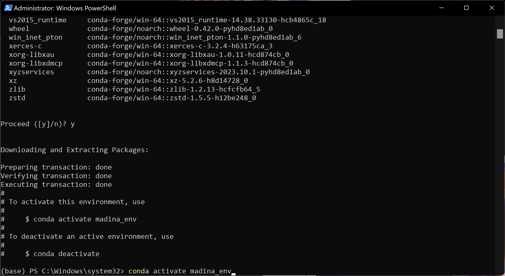
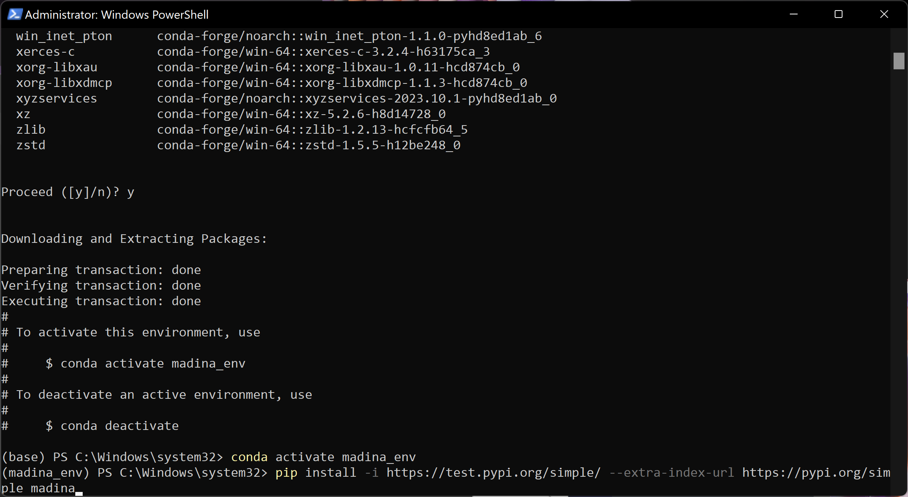
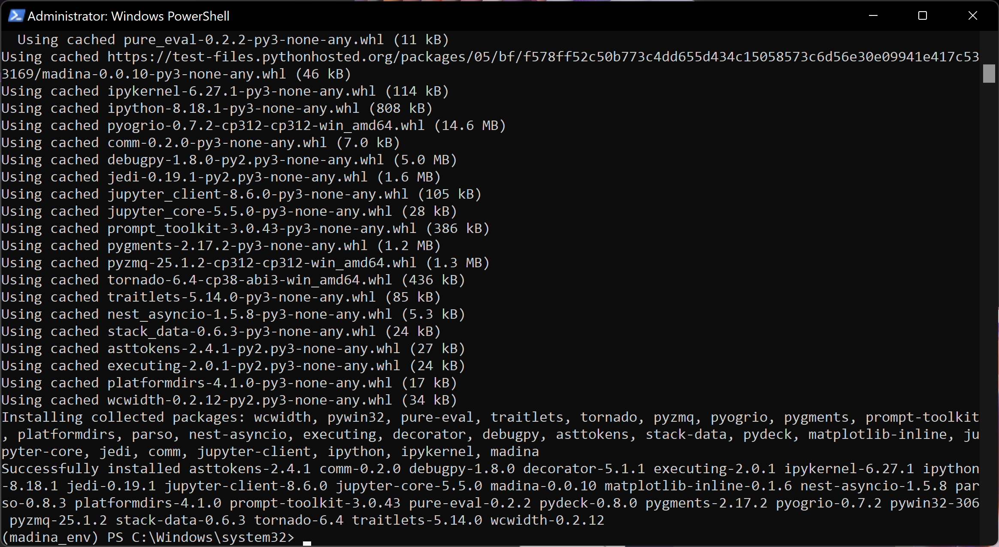

Quick Installation Guide
==========================

1) Get Conda
--------------
* Download and install `Visual Studio Code <https://code.visualstudio.com/>`_
* Download and install ``Miniconda`` from here: `Installing Miniconda <https://docs.conda.io/projects/miniconda/en/latest/miniconda-install.html>`_: click ``Download the installer``, and find thew right version for your OS.
Once you're done, continute to the next section.

2) Install Madina
-----------------------

After installing ``Miniconda``, Run your terminal as administrator
(in Windows, run ``Command Prompt`` as administrator by searching for ``Command Prompt`` in the start menu, right click, and ``Run as administrator``,, on MacOS, launch your terminal). 
Run the following command to creates an environment called ``madina_env`` and install some packages that madina depends on including `geopandas <geopandas.org/en/stable/>`_ 

.. code-block:: console

   conda create -n madina_env -c conda-forge --strict-channel-priority geopandas

Avctivate the newly created ``madina_env`` environment by running this command:

.. code-block:: console

    conda activate madina_env

Run the next command to install madina from a test repository. Keep in mind that madina is work-in-progress and we will be frequently rolling out updates. 

.. code-block:: console

    pip install -i https://test.pypi.org/simple/ --extra-index-url https://pypi.org/simple madina

3) Run an example
-----------------------

If you're familiar with programming in python, feel free to choose your favorate text editor.
The folloing instructions are useful to familiarize yourself with running madina for the first time.

* `Download the example notebooks <https://www.dropbox.com/scl/fo/vvhukdl6vc2wcprzp9kwc/h?rlkey=3zteo0dj08d5mhbeyo95v8qd2&dl=1>`_ folder, and unzip it.
* In VS code, Click FIle > Open Folder and navigate to the unzipped "notebooks"
* Open the Explorer side panel and open the first notebook. If prompted to install extensions for python and jupyter, approve and wait for extension installation **(might need to restart VScode after installing extensions)**
* Make sure to set the environment to "madina_env" that you created during package installation. you can choose/change the environment by clicking `Select Kernel` version number in the buttom right corner of VS Code
* Open the example notebooks and follow along step by step by running each cell
* if you want to take a quick look, these python notebooks are available on this website for viewing, Check the Notebooks section in the side panel.

Step-by-step visual instructions
=================================================

1) Install Conda and use it to Install Madina
----------------------------------------------
* Go to the download link for `Miniconda <https://docs.conda.io/projects/miniconda/en/latest/miniconda-install.html>`_, and click ``Download the installer``

* Pick the appropriate installer for your operarion system

* Install using default settings

.. image:: img/0-3-install-default.png
  :width: 400
  :alt: Install conda

* Run your OS's terminal as administration. on windows, run Powershell as administrator

.. note::
  In case you faced errors with the terminal/Powershell, try running the same commands using "Conda Prompt" that installs with Miniconda.

* copy and paste this command into powershell and hit enter to create a python environment called ``madina_env`` with ``geopandas`` installed.

.. code-block:: console

   conda create -n madina_env -c conda-forge --strict-channel-priority geopandas

* When prompted, type ``y`` to approve installing ``geopandas`` and its dependencies 

* activate the newly created ``madina_env`` by running this command:

.. code-block:: console

    conda activate madina_env

Install madina through pip by running this command (copy and paste into Powershell/terminal):

.. code-block:: console

    pip install -i https://test.pypi.org/simple/ --extra-index-url https://pypi.org/simple madina

You should get a message indicating successful installation of Madina and its dependencies:

2) Install VScode and Run Example
----------------------------------------------

* Download `The notebook folder <https://www.dropbox.com/scl/fo/vvhukdl6vc2wcprzp9kwc/h?rlkey=3zteo0dj08d5mhbeyo95v8qd2&dl=1>`_, and unzip it.

* Download `Visual Studio Code <https://code.visualstudio.com/>`_, a simple and powerful code editor. 

.. image:: img/1-download.png
  :width: 400
  :alt: Download VS

* Run the installer and approve all default settings, then run VScode

.. image:: img/2-Install-launch.png
  :width: 400
  :alt: Install cand Run VScode

* In VSCode, go to File > Open Folder

.. image:: img/3-open-folder.png
  :width: 400
  :alt: Open Folder

* Navigate to the  ``notebooks`` folder you just downloaded and unzipped, and select open folder. 

* Navigate to the ``Explorer`` side panels. notice that example notebooks have the extension ``.ipynb``.  Open an example notebooks.

* In the top-right corner of the notebook, click on the ``Select Kernel`` option, it might be already showing a python version, we need to make sure we pick the new python environment we just created in conda. CLick on ``Select Kernel`` or the shown python version, from the dropdown list, choose ``Python Environments``

* Depending on how many python installations you have on your machine, you'll see different options. Choose the ``madina_env`` from the list. If VS code prompts you to install a kernel/extension, approve then **Restart VS Code** 

.. image:: img/7-select-madina_env.png
  :width: 400
  :alt: Select Madina

* In the Top-left corner of each code cell, there is a Run button. CLick Run on the first cell and make sure you get a green check box in the bottum left corner

.. image:: img/8-run-cell.png
  :width: 400
  :alt: Run Cell
