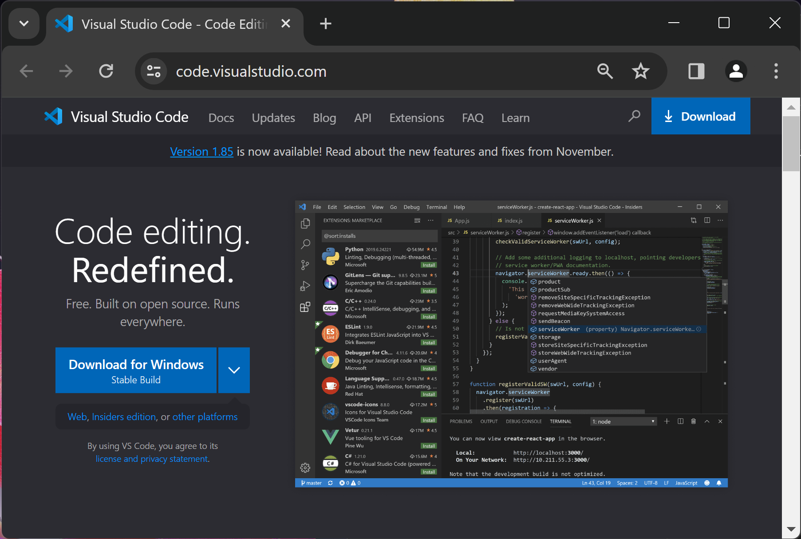
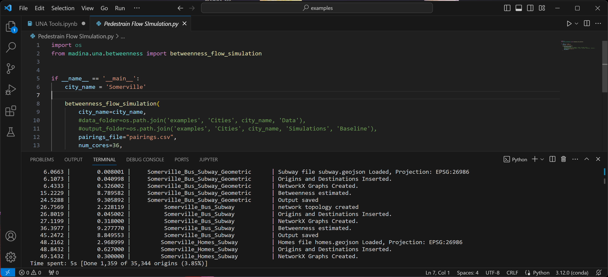

Installation Guide
==================

1) Get Conda
--------------
Download and install ``Miniconda`` from here: `Installing Miniconda <https://docs.conda.io/projects/miniconda/en/latest/miniconda-install.html>`_.
Once you're done, continute to the next section.

Conda is a an environment and packaee manager that simplify the installation of python packages.
A python environment is a collection of packages in speccific versions that work well together for a specific project. 
Conda makes it easy to create and manage environments, and if you're using python for multiple projects, it might be helpful to create an environment for each of those projects to make sure each project is using the recommended version of python and the recommended versions of each package that progect depends on.

2) Install Madina
-----------------------
Windows, MacOS, Linux
^^^^^^^^^^^^^^^^^^^^^^^
After installing ``Miniconda``, Run your terminal as administrator
(in Windows, run ``Command Prompt`` as administrator by searching for ``Command Prompt`` in the start menu, right click, and ``Run as administrator``). 
Run the following command to creates an environment called ``madina_env`` and install some packages that madina depends on including `geopandas <geopandas.org/en/stable/>`_ 

.. code-block:: console

   conda create -n madina_env -c conda-forge --strict-channel-priority geopandas

Avctivate the newly created ``madina_env`` environment by running this command:

.. code-block:: console

    conda activate madina_env

Run the next command to install madina from a test repository. Keep in mind that madina is work-in-progress and we will be launching an offical release soon.

.. code-block:: console

    pip install -i https://test.pypi.org/simple/ --extra-index-url https://pypi.org/simple madina

Once we're done testing and ready to launch, Installing madina would be possible through calling the command

.. code-block:: console

    pip install madina

3) Run an example
-----------------------

If you're familiar with programming in python, feel free to choose your favorate text editor.
The folloing instructions are useful to familiarize yourself with running madina for the first time.

* Download `The example folder <https://www.dropbox.com/scl/fi/1fbidbc5bqz7ccn61u1yq/examples.zip?rlkey=y0ppgukbyck0scw6pakrcn7f5&dl=1>`_, and unzip it.
* In VS code, Click FIle > Open Folder and navigate to the unzipped "examples folder"
* Open the Explorer side panel and open example_1.ipynb. If prompted to install extensions for python and jupyter, approve and wait for extension installation
* Make sure to set the environment to "madina_env" that you created during package installation. you can choose/change the environment by clicking the python version number in the buttom right corner of VS Code
* Open the example notebooks and follow along step by step
* if you want to take a quick look, these python notebooks are available in rthe example section of this documentation

4) Step-by-step visual instructions on Windows
Download and Install VScode
^^^^^^^^^^^^^^^^^^^^^^^^^^^^^
* Download `The example folder <https://www.dropbox.com/scl/fi/1fbidbc5bqz7ccn61u1yq/examples.zip?rlkey=y0ppgukbyck0scw6pakrcn7f5&dl=1>`_, and unzip it.

* Download `Visual Studio Code <https://code.visualstudio.com/>`_, a simple and powerful code editor. 

* Run the installer and approve all default settings, then run VScode

* In VSCode, go to File > Open Folder

* Navigate to the unzipped ``examples`` folder, and select open folder. 

.. image:: img/4-select-folder.png
  :width: 400
  :alt: Select Folder

* Navigate to the ``Explorer`` side panels. notice that example notebooks have the extension ``.ipynb`` and scripts have the extension ``.py``. Open an example notebooks

.. image:: img/5-open-notebook.png
  :width: 400
  :alt: Open Notebook

* In the top-right corner of the notebook, click on the ``Select Kernel`` option, it might be already showing a python version, we need to make sure we pick the new python environment we just created in conda. CLick on ``Select Kernel`` or the shown python version, from the dropdown list, choose ``Python Environments``

.. image:: img/6-select-python-environments.png
  :width: 400
  :alt: Select Python Environment

* Depending on how many python installations you have on your machine, you'll see different options. Choose the ``madina_env`` from the list

* In the Top-left corner of each code cell, there is a Run button. CLick Run on the first cell and make sure you get a green check box in the bottum left corner

* Now, let's try running a script. Scripts are code files that do a specific objective or provide a template. from the Explorer side panel, open the file ``Pedestrain Flow SImulation.py`` 

  In the buttom right corner of VS Code, you'll find a python version, click on it to ensure we select the right python environment, from the dropdown list, select ``madina_env``

CLick the Run Python FIle button in nthe top tight corner. The script should start running a flow simulation and show progress.

If the terminal shows progress, this mean you have successfully installed madina and managed to run a script. Feel free to close VS Code (or click the trash icon in the terminal) to stop this script. You are ready now to go through the examples.

